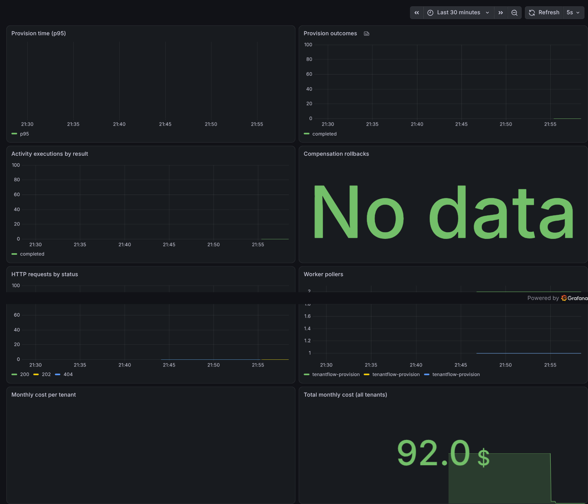
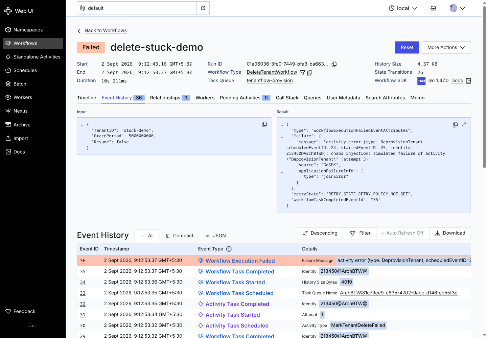

# TenantFlow

[](https://go.dev/)
[](LICENSE)
[](.github/workflows)

**A multi-tenant database platform where every lifecycle operation — provision, upgrade, migrate, backup, restore, delete — runs as a durable Temporal workflow with saga compensation, a DLQ you can retry from, chaos-injection testing, and a measured per-tenant cost model.**

The interesting part: **a deletion that fails mid-flight is resumed from a DLQ, not abandoned.** No operator SSH session, no manual SQL, no "it worked on my machine".

---

## The 60-second story

SaaS platforms quietly get away with "works on my machine" because their state is ephemeral. Tenant provisioning is **stateful and long-running**: a database must exist before an app connects, a half-created tenant must be rolled back, a dropped database must be cleaned up — and the worker may die at any point in between.

TenantFlow treats **"the worker died at 3 AM" as a normal input, not an edge case**:

```
request (HTTP/API or Temporal)
      ↓
durable workflow (survives crashes, replays history)
      ↓
saga of activities — DB, identity, quota, backup, deprovision
      ↓
failure? → compensations roll back what already happened
      ↓                    ↓
failed run → DLQ table → POST /retry resumes or re-provides
```

Every claim above is **documented and test-enforced**, not asserted:

- [`docs/idempotency.md`](docs/idempotency.md) — every operation × repeated execution, with live retry-window tests
- [`docs/failure-matrix.md`](docs/failure-matrix.md) — every activity × failure → compensation range + proof
- [`docs/load-test.md`](docs/load-test.md) — only real measured numbers (100-tenant runs, shared + dedicated)
- [`docs/demo.md`](docs/demo.md) — one-take demo script (`scripts/demo/run-demo.sh`) + shot list for the 60–120s video
- [`docs/adr/`](docs/adr/) — ADRs 0001–0007 recording *why* (Temporal, DB-per-tenant, saga, owner roles, soft delete…)

## Architecture

```
            ┌────────────────────────────────────────────────────┐
            │ cmd/api (Go, :9090)          cmd/worker (Go)        │
            │  OIDC middleware              registers workflows   │
            │  handlers / cost collector    + activities          │
            └───────┬──────────────────────────────┬─────────────┘
                    │ REST                    ┌────┴────────────┐
                    ▼                          ▼                 ▼
            ┌────────────────┐        ┌──────────────────────────────┐
            │ PostgreSQL     │        │ Temporal (durable engine)    │
            │ control plane  │        │ provision · delete · upgrade │
            │ (tenants,      │        │ migrate · backup · restore   │
            │  audit, DLQ)   │        │ reconcile                    │
            └────────────────┘        └──────┬───────────────────────┘
                                             │ activities (side effects)
                                             ▼
              ┌──────────────┬───────────────┼──────────────┬───────────┐
              ▼              ▼               ▼              ▼           ▼
         Keycloak      per-tenant      pg_dump/      quotas      cost
         identity      database      restore       (billing)   collector
                       (tenant_<id>)
```

Data separation: the **platform database** holds tenants, audit events, backups and the DLQ; every **tenant** gets its own database `tenant_<id>`, owned by a dedicated role, with `PUBLIC CONNECT` revoked.



## The hard problem: failed deletes

`DELETE /api/v1/tenants/{id}` starts `DeleteTenantWorkflow`: a durable **grace period**, then backup → deprovision → compensation bookkeeping. The screenshot below is the *real* failure moment — a chaos-injected worker killed `DeprovisionTenant` on attempt 3:



That run landed in the DLQ, and the operator's **one-call resume** (`POST /retry`) completed the deletion in seconds. The retry handler distinguishes a failed tenant from a stuck deletion instead of blindly re-running:

| Tenant status | Retry behavior |
|---|---|
| `deleted` | `409` — nothing to retry |
| `failed` | re-provision (new workflow) |
| `deleting` | resume the exact delete workflow with `{"Resume": true}` — grace period and finished transitions never repeat |
| any other active state | `409` |

## Quick start

```bash
cp .env.example .env        # dev values only — never commit your own .env
make dev-up                 # PostgreSQL :5433, Temporal :7233/UI :8080, Keycloak :8081
make dev-setup              # idempotent: tenantflow realm + platform-operator role + client
go run ./cmd/api            # :9090 — status at GET /status
go run ./cmd/worker         # consumes the tenantflow task queue
```

| Component | Address | Component | Address |
|---|---|---|---|
| API | http://localhost:9090 | Keycloak | http://localhost:8081 |
| Worker metrics | :9091/metrics | Prometheus | http://localhost:9092 |
| Temporal UI | http://localhost:8080 | Grafana (admin/admin) | http://localhost:3000 |

## API

Read-only routes need no auth; mutating routes require a Keycloak bearer token with the `platform-admin` role.

| Method & path | Auth | Purpose |
|---|---|---|
| `GET /status` | – | liveness |
| `GET /api/v1/tenants` · `/{id}` | – | list / detail |
| `GET /api/v1/tenants/{id}/events` · `/backups` · `/cost` | – | audit / backup history / cost |
| `POST /api/v1/tenants` | admin | provision (`{"tenantID","isolationMode":"dedicated\|shared"}`) |
| `DELETE /api/v1/tenants/{id}` | admin | soft delete (grace period, then deprovision) |
| `POST /tenants/{id}/cancel-delete` | admin | interrupt a pending deletion |
| `POST /tenants/{id}/upgrade` · `/migrate` · `/backup` · `/restore` | admin | lifecycle operations |
| `GET /api/v1/failed-runs` | admin | DLQ: failed workflow runs |
| `POST /api/v1/tenants/{id}/retry` | admin | resume a stuck deletion / re-provision |

## Reliability & recovery

- **Durable workflows** — every operation survives worker crashes (Temporal replays history).
- **Saga compensation** — delete/deprovision paths roll back half-done work (drop created DBs, restore quotas, restore identity).
- **Retry-safe activities** — every operation converges on retry: inspect-before-create, pre-drop leftovers, get-or-create identity, 404-as-success deletes. Proven by live retry-window tests, not hope.
- **DLQ for failed runs** — the worker mirrors failed workflows into `workflow_instances` (`status='failed'`), the source of `GET /api/v1/failed-runs`.
- **Chaos injection** — `TENANTFLOW_CHAOS_RATE` + `TENANTFLOW_CHAOS_ACTIVITIES` make the worker fail real activities at runtime; used to generate the screenshot above.

## Cost model

`GET /api/v1/tenants/{id}/cost` estimates monthly cost from **measured resource metadata** — the shape a real SaaS billing system uses: storage from live `pg_database_size`, compute/memory floors by isolation tier (dedicated ≈ $17.52/mo, shared ≈ $4.38/mo), workflows, and backups. The Prometheus collector measures every tenant on each scrape, so a deleted tenant can never leave a stale cost series.

## Testing & quality

```bash
make check           # gofmt (excl. reviewed middleware exception) → vet → build → unit
make integration     # real Postgres + real Keycloak (also runs in CI)
```

- **Unit**: workflows run in-memory (`testsuite`); the failure matrix test fails every activity of every saga and asserts the compensation range.
- **Integration**: retry-window proofs against a real database and the Keycloak get-or-create proof against a real realm.
- **CI** ([`.github/workflows/`](.github/workflows)): `test.yml` enforces the gates on every push/PR; `integration.yml` starts real Postgres + Keycloak containers and provisions the realm/role exactly like `make dev-setup`.

## Documentation index

| Doc | What it answers |
|---|---|
| [docs/idempotency.md](docs/idempotency.md) | What happens if every operation runs twice? |
| [docs/failure-matrix.md](docs/failure-matrix.md) | What happens if any activity fails? |
| [docs/load-test.md](docs/load-test.md) | Real numbers: 100-tenant provision/delete, shared + dedicated |
| [docs/demo.md](docs/demo.md) + [scripts/demo/run-demo.sh](scripts/demo/run-demo.sh) | One-take demo: happy path → failure/DLQ → replay → reconcile |
| [docs/adr/](docs/adr/) | Why these decisions? (7 ADRs) |
| [ROADMAP.md](ROADMAP.md) | Build plan with completion tracking |
| [CONTRIBUTING.md](CONTRIBUTING.md) · [SECURITY.md](SECURITY.md) | Contributing & reporting |

## Repository layout

```
cmd/api · cmd/worker     API server and Temporal worker
internal/activities      one activity per side effect
internal/workflow        workflow definitions (provision, delete, upgrade, migrate…)
internal/cloud           compute provider abstraction (Docker implementation)
internal/identity        Keycloak provider · internal/auth  OIDC middleware
internal/cost            estimation model + Prometheus collector
internal/chaos           runtime fault injection · internal/instance  DLQ recorder
internal/{repository,database,model,handler,router,config,metrics,middleware,app}
deploy/                  compose, Postgres init, Keycloak bootstrap, Prometheus, Grafana
web/                     project docs site · docs/  idempotency, failure matrix, ADRs, screenshots
```

## License

MIT — see [LICENSE](LICENSE).